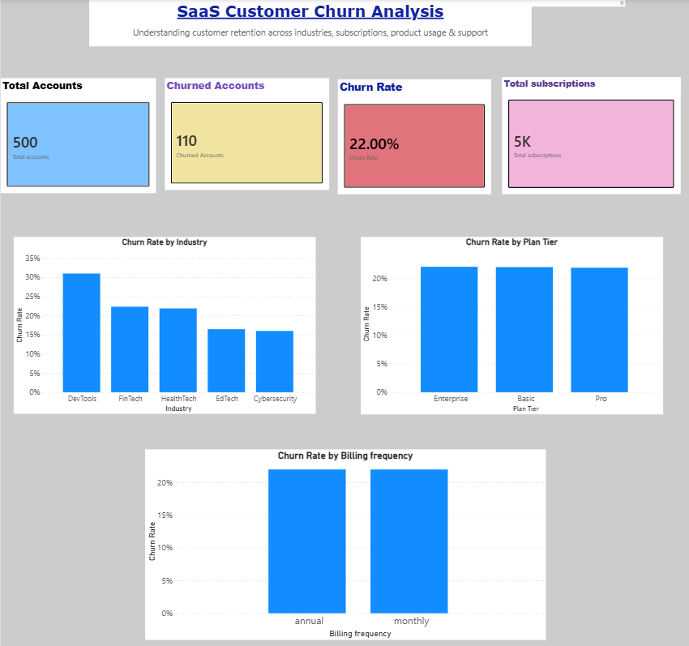
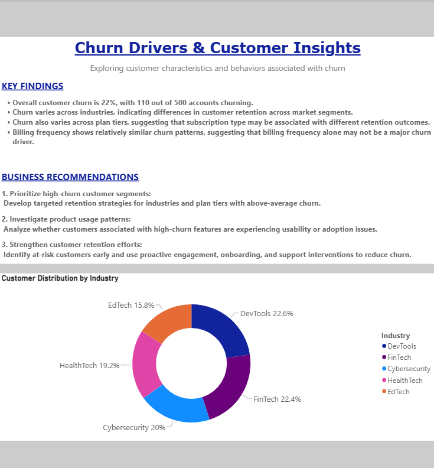

# SaaS Customer Churn Analysis

A SQL and Power BI project built around a 500-account SaaS dataset. The analysis looks at where churn is concentrated, how churn relates to product and support activity, and how much recurring revenue is associated with churned customers.

## Current snapshot

- 500 customer accounts
- 110 churned accounts
- Overall churn rate: 22%

## Tools

- SQL
- SQLite / DB Browser for SQLite
- Power BI
- Excel

## Data

The project uses five main tables:

- `accounts` — customer profile and churn status
- `subscriptions` — plan, seats, MRR/ARR, billing and renewal fields
- `feature_usage` — product feature activity
- `support_tickets` — support volume and response metrics
- `churn_events` — churn dates, reason codes, refunds and feedback

Raw files are under `data/raw/`. Analysis-ready files are under `data/analysis/`.

## SQL analysis

The main SQL file is `sql/churn_analysis.sql`.

It covers:

1. Overall churn KPIs
2. Churn by industry
3. Churn by plan
4. Churn by referral source
5. Churn by customer-size band
6. Billing frequency and auto-renewal
7. Churned MRR and ARR
8. Churn reasons
9. Feature usage and churn
10. Support metrics by customer status
11. Monthly churn
12. Industry × plan segments

The queries use joins, CTEs, conditional aggregation, `CASE`, `HAVING`, and window functions.

For example:

```sql
SUM(churned_customers) OVER (
    ORDER BY churn_month
) AS cumulative_churn
```

## Dashboard

The Power BI file is in `powerbi/`.

### Executive overview



This page shows the main customer and churn KPIs.

### Churn insights



This page looks at churn across customer and subscription segments.

## Analysis areas

### Segments

Churn is compared across industry, plan tier, customer size, referral source, billing frequency and auto-renewal.

### Revenue at risk

The SQL analysis calculates churned MRR and ARR by plan, so the project looks at recurring revenue as well as customer counts.

### Product usage

Feature usage is joined back to accounts to compare churn rates across features.

### Support

Support-ticket volume, response time, resolution time and escalation rate are compared between churned and active customers.

### Churn reasons

Recorded reason codes such as pricing, features, support, budget and competitor are summarized from the churn-event table.

These relationships are treated as things to investigate. They do not prove that a particular factor caused churn.

## Limitations

- The dataset is a public/constructed analytical dataset, not a live production database.
- The analysis is descriptive and does not build a churn-prediction model.
- Observed relationships do not establish causation.
- Churn reasons depend on the recorded reason codes and feedback.
- The dashboard is a portfolio analysis rather than a production BI deployment.

## Project structure

```text
Saas-customer-churn-analysis/
├── README.md
├── data/
│   ├── raw/
│   └── analysis/
├── sql/
│   ├── churn_analysis.sql
│   └── Churn Analysis.sqbpro
├── powerbi/
│   └── Customer Churn Analysis.pbix
└── dashboard/
    ├── executive_overview.png
    └── churn_insights.png
```

## Run

1. Open the data in SQLite / DB Browser for SQLite.
2. Run `sql/churn_analysis.sql`.
3. Review the grouped results.
4. Open the Power BI file for the dashboard.
5. Use the SQL results and dashboard together when discussing the findings.

## Author

Aanand Ajith — B.Tech Mechanical Engineering, IIT Hyderabad
